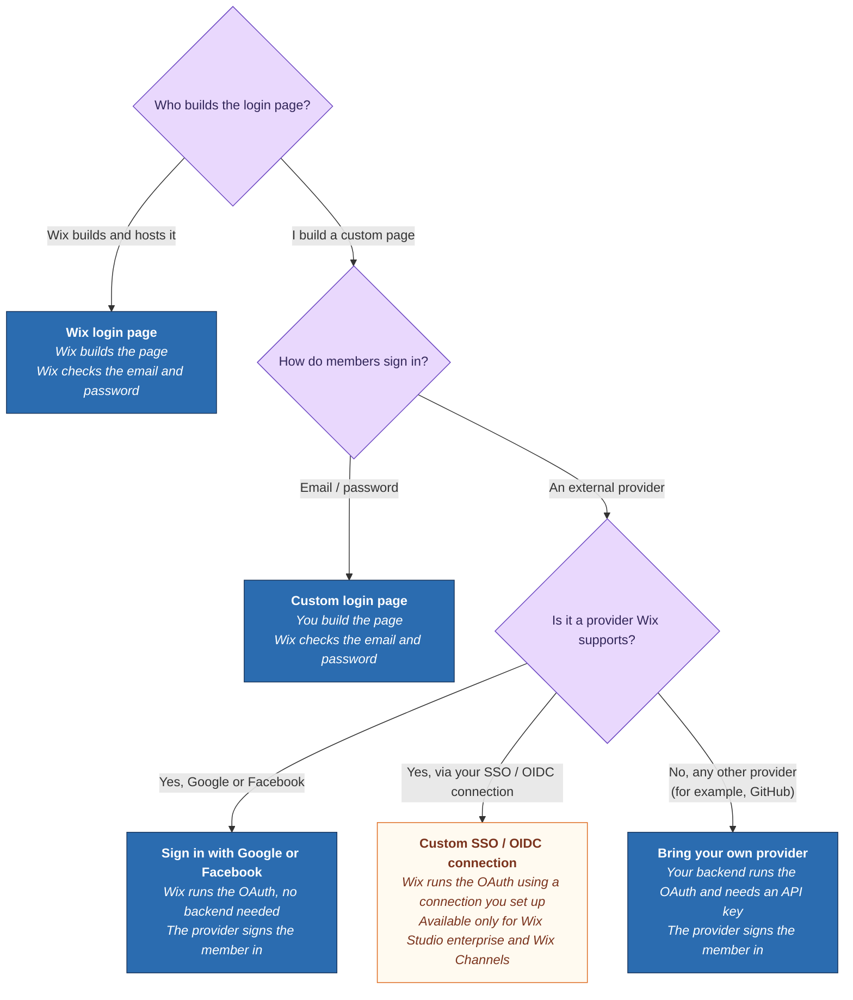

Member login lets people sign in to access personalized content on a site, such as their profile, saved items, or order history.

## Choose how members sign in

Wix Headless supports several ways for members to sign in. The right one depends on who builds the login page and, for a page you build, how members sign in.

- **Wix login page.** Wix hosts the login UI and runs authentication. Members sign in with an email and password, plus any social providers you enable, such as Google or Facebook. This is the only option when you build with [Wix's Astro integration](https://dev.wix.com/docs/go-headless/wix-managed-headless/full-integration-astro/about-the-astro-integration), which [handles member login for you](https://dev.wix.com/docs/go-headless/authentication/members/wix-login-page/add-member-login-with-the-astro-integration). Otherwise, add it with the [JS SDK](/kb/authentication/add-a-wix-login-page-js-sdk) or [REST API](https://dev.wix.com/docs/go-headless/authentication/members/wix-login-page/add-a-wix-login-page-rest).
- **A login page you build.** Choose based on what members sign in with:
  - **Email and password, verified by Wix.** Build a custom login page: you host the UI, and Wix authenticates the credentials. This is best when you want a fully branded login experience. Build it with the [JS SDK](/kb/authentication/build-a-custom-login-page-js-sdk) or [REST API](https://dev.wix.com/docs/go-headless/authentication/members/custom-login-page/build-a-custom-login-page-rest).
  - **An external identity provider.** The difference is who runs the provider's sign-in:
    - **Wix runs it.** Sign in with Google or Facebook: you add a provider button to your own UI, and Wix runs the provider's authentication. No API key needed. Works with Google or Facebook on any site, or with a custom single sign-on (SSO) or OpenID Connect (OIDC) connection on Wix Studio enterprise and Wix Channels sites (see [Setting up SSO](https://support.wix.com/en/article/sso-setting-up-single-sign-on-sso-login-for-your-site-members)). Available with the [JS SDK](https://dev.wix.com/docs/go-headless/authentication/members/identity-providers/sign-in-with-google-or-facebook-js-sdk) or [REST API](https://dev.wix.com/docs/go-headless/authentication/members/identity-providers/sign-in-with-google-or-facebook-rest).
    - **You run it.** [Bring your own identity provider](https://dev.wix.com/docs/go-headless/authentication/members/identity-providers/bring-your-own-identity-provider): for a provider you handle yourself, such as GitHub, you run the provider's authentication and sync the result with Wix. This requires a Wix API key, which must be used only in backend code and never exposed in the frontend.

## Prerequisites

Before implementing member login, make sure you've:

- [Set up a headless client](/kb/authentication/set-up-a-headless-client) to get your client ID.
- [Added the allowed redirect URIs](https://dev.wix.com/docs/go-headless/authentication/setup/allow-redirect-uris-and-domains) that your login flow redirects to.

Some options need additional setup:

- **Custom login page**: [Set your custom login page URL](https://dev.wix.com/docs/go-headless/authentication/members/custom-login-page/set-your-custom-login-page-url) so that Wix-hosted flows requiring login can reach your page.
- **Bring your own identity provider**: a [Wix API key](/kb/authentication/generate-an-api-key) with Members & Contacts permissions.

## See also

- [Add a Wix Login Page (JS SDK)](/kb/authentication/add-a-wix-login-page-js-sdk)
- [Build a Custom Login Page (JS SDK)](/kb/authentication/build-a-custom-login-page-js-sdk)
- [Sign In with Google or Facebook (JS SDK)](https://dev.wix.com/docs/go-headless/authentication/members/identity-providers/sign-in-with-google-or-facebook-js-sdk)
- [Bring Your Own Identity Provider](https://dev.wix.com/docs/go-headless/authentication/members/identity-providers/bring-your-own-identity-provider)
